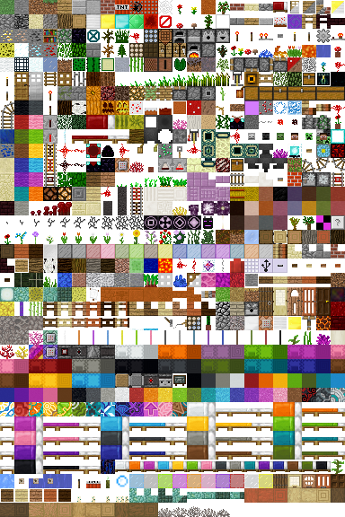
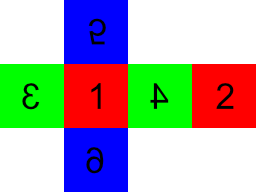

# PYNECRAFTER

minercraft clone with python

# import libraries

```
$ pip install -r requirements.txt
```

# Run

```
$ python main.py
or
$ python3 main.py
```

# Directories

```
# ディレクトリ構造
Documents/
  ├ pynecrafter/
  │  ├ images/
  │  │  ├ 48-488312_blockcss-minecraft-terrain-png-1-0-0.py
  │  │  
  │  ├ textures/
  │  │  ├ head/
  │  │  │  ├ 1.png
  │  │  │  ├ 2.png
  │  │  │  ├ 3.png
  │  │  │  ├ 4.png
  │  │  │  ├ 5.png
  │  │  │  ├ 6.png
  │  │  ├ body/
  │  │  │  ├ 1.png
  │  │  │  ├ 2.png
  │  │  │  ├ 3.png
  │  │  │  ├ 4.png
  │  │  │  ├ 5.png
  │  │  │  ├ 6.png
  │  │  ├ hand/
  │  │  │  ├ 1.png
  │  │  │  ├ 2.png
  │  │  │  ├ 3.png
  │  │  │  ├ 4.png
  │  │  │  ├ 5.png
  │  │  │  ├ 6.png
  │  │  ├ leg/
  │  │  │  ├ 1.png
  │  │  │  ├ 2.png
  │  │  │  ├ 3.png
  │  │  │  ├ 4.png
  │  │  │  ├ 5.png
  │  │  │  ├ 6.png
  │  │  ├ 0-1.png
  │  │  ├ 0-2.png
  │  │  
  │  ├ models/
  │  │  ├ grass_block.egg
  │  │  ├ stone.egg
  │  │  ├ dirt.egg
  │  │  
  │  ├ src/
  │  │  ├ __init__.py
  │  │  ├ block.py  # ブロック関連
  │  │  ├ player.py  # プレイヤー関連
  │  │  ├ player_model.py  # プレイヤーモデル関連
  │  │  ├ camera.py  # カメラ関連
  │  │  ├ target.py  # ターゲットブロック関連
  │  │  ├ mc.py  # 統合クラス
  │  │  
  │  ├ 01_01_showbase.py
  │  ├ 01_02_showbase.py
  │  ├ 01_03_showbase.py
  │  ├ xxx.py
  │  ├ 05_01_main.py
  │  ├ 06_01_main.py
  │  ├ 07_01_egg_model_maker_1_2_3_4_5_6.py  # ブロックを作成
  │  ├ 07_02_main.py  # 統合クラスをインポートしてゲームを起動する
  │  

```

## Textures

 

https://www.seekpng.com/ipng/u2q8e6a9a9i1r5t4_blockcss-minecraft-terrain-png-1-0-0/

## Block Textures Development View

 

## Blocks

```
all_block_ids = [
    'steve',
    'steve_body',
    'steve_right_hand',
    'steve_right_leg',
    'steve_left_hand',
    'steve_left_leg',
    'stone',
    'grass_block',
    'dirt',
    'cobblestone',
    'oak_planks',
    'spruce_planks',
    'birch_planks',
    'jungle_planks',
    'bedrock',
    'water',
    'lava',
    'sand',
    'gravel',
    'oak_log',
    'spruce_log',
    'birch_log',
    'jungle_log',
    'oak_leaves',
    'sponge',
    'glass',
    'lapis_ore',
    'lapis_block',
    'note_block',
    'sticky_piston',
    'cobweb',
    'tall_grass',
    'white_wool',
    'orange_wool',
    'magenta_wool',
    'light_blue_wool',
    'yellow_wool',
    'lime_wool',
    'pink_wool',
    'gray_wool',
    'light_gray_wool',
    'cyan_wool',
    'purple_wool',
    'blue_wool',
    'brown_wool',
    'green_wool',
    'red_wool',
    'black_wool',
    'gold_block',
    'iron_block',
    'diamond_block',
    'emerald_block',
    'coal_block',
    'bricks',
    'tnt',
    'bookshelf',
    'obsidian',
    'diamond_ore',
    'furnace',
    'piston',
    'burning_furnace',
    'redstone_ore',
    'snow',
    'ice',
    'cactus',
    'pumpkin',
    'jack_o_lantern',
    'glass_pane',
]
```